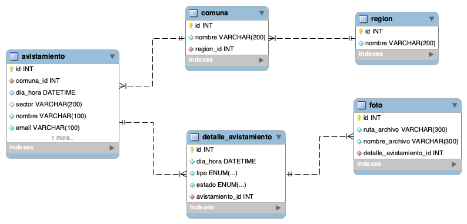

# CC5002-DesarrolloDeAppWeb
Repositorio del curso CC5002: Desarrollo de Aplicaciones Web

### Modelo de datos


### Sitio de deploy: [anakena/~siaguile](https://anakena.dcc.uchile.cl/~siaguile/Tarea2/index.html)

### Despliegue local
```
python3 -m htt.server --bind localhost --cgi <port> 
```

### Conexión BDD
Motor: MySQL
Database: cc500270_db
User: cc500270_u
password: ibuspellen

Migración inicial:  

```
mysql -u cc500270_u -p cc500270_db < sql/tarea2.sql
mysql -u cc500270_u -p cc500270_db < sql/region-comuna.sql
```